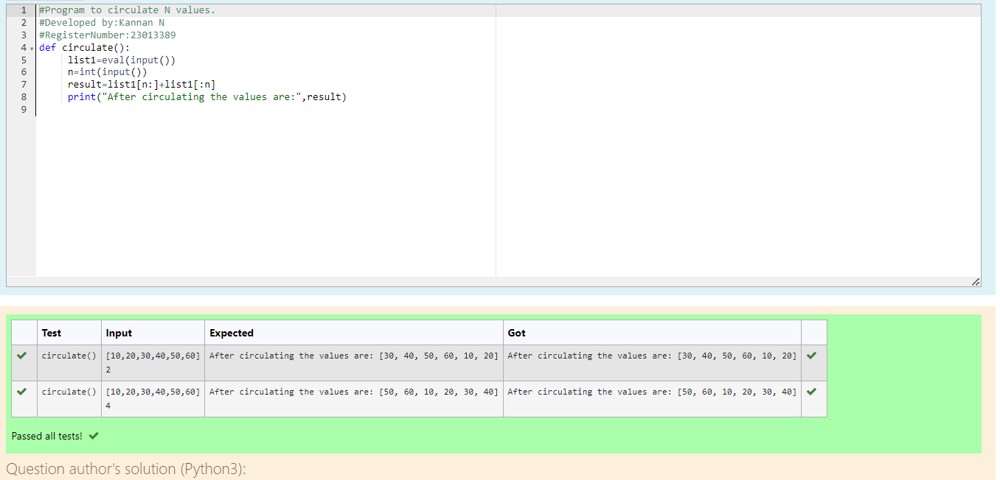

# Circulate-the-values-of-N-variables
## Aim:
To write a python program to circulate the n variables using function concept
## Equipment’s required:
PC
Anaconda - Python 3.7
## Algorithm: 
### Step 1:
start the program
### Step 2: 
Get the value from the user for the number of rotation 
### Step 3: 
Print the circulating values
### Step 4: 
Using the slicing concept rotate the list

### Step 5: 
Evaluate the input.
### Step 6: 
Enter a integer(n) in input.

## Program:
``````
#Program to circulate N values.
#Developed by:Kannan N
#RegisterNumber:23013389
def circulate():
     list1=eval(input())
     n=int(input())
     result=list1[n:]+list1[:n]
     print("After circulating the values are:",result)
``````
## Output:

## Result:
Here,the program is succesfully executed
